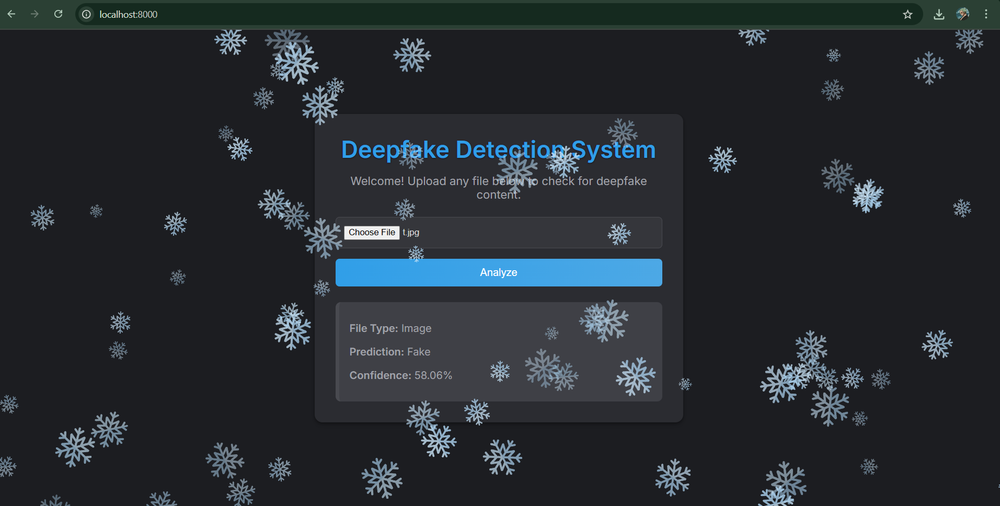

# Deepfake Detection System

## Introduction

Deepfakes, or AI-generated synthetic media, pose significant threats to the authenticity of audio and visual content shared across digital platforms. As these technologies become more accessible and convincing, it becomes crucial to develop tools that can detect manipulated media. This project presents a practical, modular deepfake detection system capable of analyzing images, audio, and videos (with or without audio) for signs of manipulation.

## What We Built

This system is a multi-modal deepfake detector that accepts various media types and provides predictions with confidence scores through a user-friendly web interface. It uses:

* **CNN-based models** for detecting tampered images
* **Wav2Vec 2.0 model** for detecting spoofed audio
* **Custom frame-based video analysis** using the same image model over extracted frames

The services are containerized using Docker and communicate through a FastAPI-based gateway.

## Models Used

* **Image/Video Deepfake Detection Model:** [prithivMLmods/Deep-Fake-Detector-Model](https://huggingface.co/prithivMLmods/Deep-Fake-Detector-Model)
* **Audio Anti-Spoofing Model:** [Wav2Vec 2.0 (Facebook AI)](https://huggingface.co/facebook/wav2vec2-base-960h)
* **Face Detection Model:** `WIDERFace_DSFD_RES152.pth` (used in face\_detection\_service)

## Architecture Overview

* `frontend/`: Simple HTML/CSS/JS interface to upload files and view results
* `image_service/`: Detects tampered images using a CNN
* `audio_service/`: Detects spoofed audio using Wav2Vec 2.0-based model
* `video_service/`: Extracts frames from video and analyzes using image model
* `face_detection_service/`: Optional component for preprocessing frames or localizing faces
* `api_gateway/`: Routes file uploads to the appropriate backend service
* `shared/`: Shared utility functions
* `docker-compose.yml`: Manages the multi-container setup

## Process Workflow

1. User uploads a media file via the web interface
2. The file is sent to the API Gateway
3. Gateway detects media type and forwards to respective service:

   * Image: Sent to image\_service
   * Audio: Sent to audio\_service
   * Video: Sent to video\_service
4. Predictions are processed:

   * Image: CNN model classifies as Real or Fake
   * Audio: Wav2Vec 2.0 model analyzes waveform for spoofing
   * Video: Frames extracted, each analyzed using CNN, then aggregated
5. Results are sent back to frontend for display

## Setup Instructions

### Prerequisites

* Docker & Docker Compose
* (Optional) Python 3.10+ if running without Docker

### Clone the Repository

```bash
git clone https://github.com/yourusername/deepfake-detection-system.git
cd deepfake-detection-system
```

### Build and Run Containers

```bash
docker-compose up --build
```

This command will build and start all the services defined in the `docker-compose.yml` file.

### Access the Web Interface

Once all services are running, navigate to:

```
http://localhost:8000
```

## Usage

1. Upload an image, audio file, or video using the web interface.
2. The system automatically sends the media to the appropriate service.
3. The prediction (Real or Fake) is displayed along with a confidence score.

### Example Output Screenshots

**Image Upload:**


**Audio Upload:**


**Video Upload:**


## Project Structure

```bash
deepfake-detection-system/
├── audio_service/
│   ├── app/
│   │   ├── main.py
│   │   └── model.py
│   ├── uploads/
│   ├── Dockerfile
│   └── requirements.txt
├── face_detection_service/
│   ├── app/
│   │   ├── main.py
│   │   └── model.py
│   ├── uploads/
│   ├── Dockerfile
│   └── requirements.txt
├── image_service/
│   ├── app/
│   │   ├── main.py
│   │   └── model.py
│   ├── uploads/
│   ├── Dockerfile
│   └── requirements.txt
├── video_service/
│   ├── app/
│   │   ├── main.py
│   │   └── model.py
│   ├── Dockerfile
│   └── requirements.txt
├── frontend/
│   ├── index.html
│   ├── styles.css
│   └── script.js
├── shared/
├── docker-compose.yml
└── README.md
```

## Contributing

Contributions are welcome! Please fork the repository and submit a pull request for any enhancements or bug fixes.

## License

This project is licensed under the MIT License. See the LICENSE file for details.

## Acknowledgments

* [prithivMLmods/Deep-Fake-Detector-Model](https://huggingface.co/prithivMLmods/Deep-Fake-Detector-Model)
* [Wav2Vec 2.0](https://huggingface.co/facebook/wav2vec2-base-960h)
* [FastAPI](https://fastapi.tiangolo.com/) — Web framework
* [Docker](https://www.docker.com/) — Containerization

## 📬 Contact

If you have any queries, suggestions, or need help regarding this project, feel free to reach out.  
**📧 Mail me — I’ll be happy to help!**  
📮 Email: shashirathod2307@gmail.com
